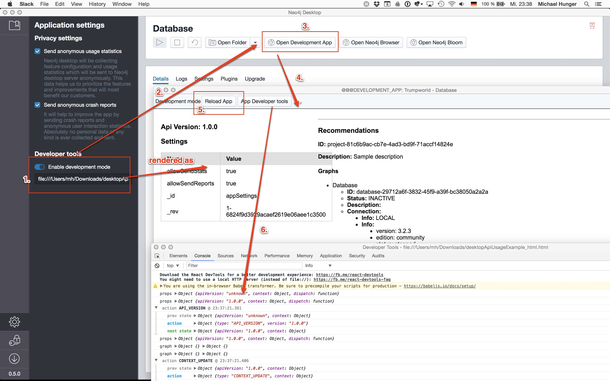
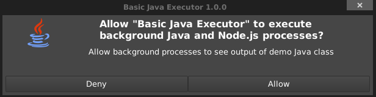

# Neo4j Desktop Graph App API

To give a 3rd party applications the possibility to know,
what active graph is and where it is contained, we provide a context.

First of all, context expose to the apps all data, that could be viable for them to operate -
configurations, projects, graphs.

Context itself is an immutable structure which is generated on demand,
but all context changes are interceptable, so the apps could react to context changes immediately.

Check out [Changelog](CHANGELOG.md) to follow API changes.

We provide a Neo4j Desktop Canary channel with nightly builds of Neo4j Desktop so developers can verify that their graph application works in the coming release.  
See https://neo4j.com/download-center/ -> Neo4j Desktop -> Pre-releases.

## Development mode

Neo4j Desktop have `Development mode`.

To enable it, open `Settings` pane in Sidebar and toggle switch in `Developer tools` section.

### Development mode settings

When development mode is enabled, additional app is added to the list of other apps: `Development App`.

Developer needs to setup entry point and application root directory for Graph App in settings.

Settings:

* Entry Point
  * Supported formats:
      * File: load `.html` file directly from filesystem
        * Example: `file:///Users/me/work/graph-app/index.html`
      * HTTP: load arbitrary `URL`
        * Example: `http://localhost:3000`
* Root Path
    * Example: `/Users/me/work/graph-app`

**Note:** settings are not saved between Neo4j Desktop restarts.



## Example

Available examples:

- [Simple application created with create-react-app-graphql](examples/basic-create-react-app-graphql)
- [Simple application executing Java](examples/basic-java-executor)

#### Quickstart example

To prepare the graphQL connection, you'll need a set of libraries, we recommend using these
```
yarn add apollo-client apollo-link apollo-link-http apollo-link-ws
```

For managing both subscriptions and queries, passing custom headers, you'll need these
```
yarn add apollo-link-context apollo-utilities
```

The following code shows how to initialize the connection to the graphql server

```ecmascript 6
// All the necessary information is available in the url, as searchParams
const url = new URL(window.location.href);
// Url of a graphQL endpoint
const apiEndpoint = url.searchParams.get('neo4jDesktopApiUrl');
// A Desktop generated token to verify the provided appId 
const apiClientId = url.searchParams.get('neo4jDesktopGraphAppClientId');

// http link to execute graphQL queries
const httpLink = createHttpLink({
        uri: `http://${apiEndpoint}/`,
});

// websocket link to be able to subscribe to the Desktop events
const wsLink = new WebSocketLink({
    uri: `ws://${apiEndpoint}/`,
    options: {
        reconnect: true,       
        connectionParams: {
            ClientId: apiClientId
        }
    }
});

// link needed to inject custom headers to every query, 
// so that Neo4j Desktop could identify the graph app and give as much data as it can
const authLink = setContext((_, {headers}) => {
    return {
        headers: {
            ...headers,
            ClientId: apiClientId
        }
    }
});

// general link, used to choose a correct endpoint between the operation types
const link = split(
    // split based on operation type
    ({query}) => {
        const {kind, operation} = getMainDefinition(query);
        return kind === 'OperationDefinition' && operation === 'subscription';
    },
    wsLink,
    authLink.concat(httpLink),
);

// at this point client is ready to use
const client = new ApolloClient({
    link: link,
    cache: new InMemoryCache()
});

```

After the client has been initialized, you can execute queries and start subscriptions to the Desktop GraphQL server.
The format of the output data is almost the same as it was before, when contextAPI was in place.

```js
client.query({
    query: /* your query */
}).then(({data}) => {
    // do something with data here
});

const observable = client.subscribe({
    query: /* subscribe query */
});
observable.subscribe(({data}) => {
    // do something with data here, this callback will be triggered every time Desktop has its data changed
});
```

Extended example you can find [here](examples/basic-create-react-app)

Also the fallback API is still being injected into the graph apps, so that you could still use the API in the old way.

**Note** that fallback API is deprecated and will be removed in Desktop 1.2 (the exact date is not known yet, wait for the announcement).
```js
/**
 * If application can run in multiple environments, detect that we are in Desktop.
 */
if (window.neo4jDesktopApi) {
    // API will be available in global `window` variable `neo4jDesktopApi`.


    // Listen for context changes
    neo4jDesktopApi.onContextUpdate((event, newContext, oldContext) => {
        if (event.type === '...') {
            // do something if event is of specific type
        }

       // check context changes and apply them
    });

    // Get current context.
    // Should be used if application requires current context when it starts.
    neo4jDesktopApi.getContext()
        .then((context) => {
            // initialize application with context
        });   
}
```

## Distribution

### Structure
Graph applications should be distributed as a valid [npm package file](https://docs.npmjs.com/files/package.json),
where `dist` folder contains a default app entry point `index.html`.

### Installation
To install a self updating graph application, you enter a link to a npm style repository for the graph application.  
Example for neo4j-browser: `http://neo.jfrog.io/neo/api/npm/npm/neo4j-browser`.  
This application will self update on every release (see below for how to display release notes).

or

Pack and upload a `.tgz` file (following the structure explained above) and enter the URL to it in the graph application sidebar. This will be downloaded once and never updated.

or

Host a web application yourself and "install" it by inserting the URL to it in the graph application sidebar.


### Neo4j Desktop API version support
Manifest file `manifest.json` should be placed in `/dist` folder and contain information about the Graph App. Including Neo4j Desktop API version that is used.
*Note:* You can either specify explicit `apiVersion` or semver range.

The fallback is using the `package.json` file if no manifest file is found.

Example:

```json
{
    "name": "my-graph-app",
    "version": "1.0.0",
    "description": "(desktop)-[:LOVES]->(apps)",
    "homepage": "http://neo4j.com",
    "neo4jDesktop": {
        "apiVersion": "^1.2.0"
    }
}
```

### Graph application metadata

**For packages graph applications**

Neo4j Desktop scans `manifest.json` for the fields `neo4jDesktop`, `name`, `description`, `icons`, and `homepage` to show the values of these fields
on the UI.  
To customize the look of the graph app inside Neo4j Desktop - include an icon to the distribution and add `icons`
property to the `manifest.json`.

*Note:* The paths should be relative to the location of the manifest file where they are specified:
- If they are specified in `package.json`, their src should be relative to the graph app root.
- If they are specified in `dist/manifest.json` their src should be relative to the `dist/` folder.

Icon type could be any image type, or inline data URI.
Example:
```json
{
    "name": "my-graph-app",
    "description": "(desktop)-[:LOVES]->(apps)",
    "icons": [
        {
          "src": "./my-image.png",
          "type": "png"
        },{
          "src": "./my-vector-image.svg",
          "type": "svg"
        },{
          "src": "data:image/svg+xml;base64,[data]",
          "type": "data"
        }
    ],
    "homepage": "http://neo4j.com"
}
```

**For online/hosted graph applications**

Neo4j Desktop looks for a `manifest.json` in the web root and look for a `<name>` tag to derive graph app name. The icon will be fetched from the `<link rel="icon">` tag if it exists.

The fallback is using the documents `<title>` tag if no manifest file is found.

### Graph application release notes on updates
Include `release-notes.md` on the same level as `package.json` to have Neo4j Desktop display your applications release notes when it's updated.

**Notes:**

- Ensure that `neo4jDesktop.apiVersion` is properly configured.
- Ensure that package have proper structure.

## Requesting permissions

If a graph application needs to use a privileged API (such as bundled Java or Node.js script execution), the app has to check and request the appropriate permission. Declare that your app needs a permission by listing the permission in the app manifest and then request that the user approve each permission at runtime.

### Declare permissions in the manifest

To declare that your app needs a permission, put a `permissions` field in your app `manifest.json`

Example:
```json
{
  "name": "my-graph-app",
  "permissions": [
    "backgroundProcess",
    "allGraphs",
    "activeGraph"
  ]
}
```

Currently available permissions:

| Permission        | Description                                                                                      |
|-------------------|--------------------------------------------------------------------------------------------------|
| activeGraph       | Gives access to the  active Graph data.<br> This is a default permission granted on app install. |
| allGraphs         | Gives access to all the configured Graphs.                                                       |
| backgroundProcess | Gives access to `executeJava` and `executeNode` API.

  
**Explain why the app needs permissions**

To help the user understand why your app needs a permission, add usage description to the list of permissions in form of map-like object:

```json
{
  "name": "my-graph-app",
  "permissions": [
    "activeGraph",
    {
      "backgroundProcess": "Allow background processes to see output of demo Java class",
      "allGraphs": "Another usage description here"
    }
  ]
}
```

### Check for permission

To check if you have a permission, call the `checkPermission()` method. 

```js
window.neo4jDesktopApi.checkPermission('backgroundProcess')
    .then(granted => {
        if (!granted) {
            // Permission is not granted.
        }
    })
```

### Request the permission

If your app doesn't already have the permission it needs, call `requestPermission()` method to request the appropriate permission from user. Only permissions declared in app manifest can be requested.

```js
window.neo4jDesktopApi.requestPermission('backgroundProcess')
    .then(granted => {
        if (granted) {
            // Permission granted.
        } else {
            // Permission denied.
        }
    })
```

If the permission has not been already granted, the system dialog box is shown:



## Technical details

#### Application data location

| OS | Location |
|----|----------|
| macOS | ~/Library/Application Support/Neo4j Desktop |
| Windows pre 1.0.19 | %APPDATA%/Neo4j Desktop |
| Windows post 1.0.19 | %USERPROFILE%/.Neo4jDesktop |
| Linux | ~/.config/Neo4j Desktop |

## Reference

*Note:* API is under development and it can be changed, based on user feedback.

*Note:* API definition is presented using TypeScript syntax.

```typescript

export interface DesktopApi {
    /**
     * API version.
     */
    version: string;
    
    /**
     * Asynchronously get current context.
     */
    getContext: () => Promise<Context>;
    
    /**
     * Register callback to receive context updates when events are happening.
     */
    onContextUpdate: (callback: (event: Event, newContext: Context, oldContext: Context) => void) => void;
    
    /**
     *  Execute any jar, bundled inside you app package or given path. Will return wrapped process with API provided
     */
    executeJava: (parameters: JavaParameters) => Promise<Process>;
    
    /**
     *  Execute any node script, bundled inside you app package or given path.
     *  Will return wrapped process with API provided
     */
    executeNode: (filePath: string, args: [string], options: ExecOptions) => Promise<Process>;
    
    /**
     * Requests a permission from user.
     * Only permissions declared in `manifest.json` can be requested.
     *
     * Permissions types:
     *
     * activeGraph         access active Graph data
     * allGraphs           access to all the configured Graphs
     * backgroundProcess   execute background Java and Node.js processes
     *
     * @param permission
     * @return true if permission is granted
     */
    requestPermission: (permission: PermissionType) => Promise<boolean>;
    
    /**
     * Check if a permission is granted.
     * @param permission
     */
    checkPermission: (permission: PermissionType) => Promise<boolean>;
    
    /**
     * Asynchronously get kerberos ticket for given service principal
     * Service principal can be found in context
     */
    getKerberosTicket: (servicePrincipal: string) => Promise<KerberosTicketResult>;
    
    /**
     * Register callback to receive arguments updates
     * paramsString - pures string with params. ex.: cmd=play&args=music
     * params - parsed params Map ([key: string]: string | null)
     *
     * How to call graph-app with param - neo4j://GraphAppName?cmd=play&args=music
     */
    onArgumentsChange: (callback: (paramsString: string, params: ParamsMap) => void) => void;
    
    getJwtToken: (dbId: string) => Promise<JWTTokenResult>;
    
}

export interface ParamsMap {
    [key: string]: string | null;
}

export type PermissionType = 'activeGraph' | 'allGraphs' | 'backgroundProcess';

//---------------
// Java
//---------------

export type JavaParameters =
    /**
     * Specify class or jar that should be executed.
     * Path to a .jar file can either be relative to App Path or absolute.
     * Example: 'Main'
     * Example: './test.jar'
     */
    { [x in 'class' | 'jar']: string } & {
    /**
     * JVM arguments.
     * Example: ['-DmyProperty=value', '-Xdebug']
     */
    options: string[];

    /**
     * Jar's that will be added to classpath.
     * Example: ['./test.jar', '/opt/lib/test.jar']
     */
    classpath: string[];

    /**
     * Argument passed to a main.
     * Example: ['one', 'two', 'three']
     */
    arguments: string[];
};

type ProcessStatus = 'RUNNING' | 'STOPPED' | 'KILLED';

interface Process {
    /**
     * Stop the process tree gracefully, if fails - kill the process tree forcefully
     */
    stop(): Promise<boolean>;

    /**
     * Get the actual status of the process
     */
    status(): Promise<ProcessStatus>;

    /**
     * Get the list of PIDs for whole process tree
     */
    getProcessTreeIds(): Promise<number[]>;

    /**
     * Listen to process-related errors (e.g. not being able to start)
     */
    onError(listener: (error: Error) => void): void;

    /**
     * Listen to process exit event. Provides the status which was assigned the last.
     */
    onExit(listener: (status: ProcessStatus) => void): void;

    /**
     * Attach to the stdout stream
     */
    addOutListener(listener: (data: string) => void): void;

    /**
     * Attach to the stderr stream
     */
    addErrListener(listener: (errData: string) => void): void;
}

//---------------
// Node
//---------------

interface EnvOptions {
    [key: string]: string;
}

export interface ExecOptions {
    cwd?: string;
    env?: EnvOptions;
}

//---------------
// Kerberos
//---------------

interface KerberosTicketResult {
    ticket?: string;
    error?: string;
}

//---------------
// JWT
//---------------

export interface JWTTokenResult {
    token?: string;
    error?: string;
}

//---------------
// Context
//---------------

export interface Context {
    global: {
        settings: Settings;
        online: boolean;
    };
    projects: Project[];
    activationKeys: GraphAppLicense[];
}

export interface GraphAppLicense {
    featureName: string;
    expirationDate: string;
    activationVersion: string;
    featureVersion: string;
    registrant: string;
    organization: string;
    email: string;
    signature: string;
}

export interface Settings {
    allowSendStats: boolean;
    allowSendReports: boolean;
    allowStoreCredentials: boolean;
}

export interface Project {
    id: string;
    name: string;
    graphs: Graph[];
}

export interface Graph {
    id: string;
    name: string;
    description: string;
    status: 'ACTIVE' | 'INACTIVE';
    connection: GraphLocalConnection | GraphRemoteConnection;
}

export interface GraphLocalConnection {
    type: 'LOCAL';
    databaseType: 'neo4j';
    databaseStatus: GraphLocalConnectionStatus;
    info: {
        version: string;
        edition: string;
    };
    configuration: GraphLocalConnectionConfiguration;
}

export interface GraphLocalConnectionConfiguration {
    path: string;
    protocols: {
        bolt: {
            enabled: boolean;
            host: string;
            port: number;
            tlsLevel: 'OPTIONAL' | 'REQUIRED' | 'DISABLED';
            username?: string;
            password?: string;
            url: string;
        };
        http: {
            enabled: boolean;
            host: string;
            port: number;
            url: string;
        };
        https: {
            enabled: boolean;
            host: string;
            port: number;
            url: string;
        };
    };
    authenticationMethods?: {
        kerberos: {
            enabled: boolean;
        };
    };
}

export type GraphLocalConnectionStatus =
    | 'STOPPED'
    | 'STOPPING'
    | 'STARTING'
    | 'RESTARTING'
    | 'RUNNING'
    | 'UNKNOWN'
    | 'NEW'
    | 'CREATING'
    | 'REMOVING'
    | 'UPGRADING'
    | 'MISSING';

export interface GraphRemoteConnection {
    type: 'REMOTE';
    databaseType: 'neo4j';
    databaseStatus: GraphRemoteConnectionStatus;
    info: {
        version: 'UNKNOWN' | string;
        edition: 'UNKNOWN' | string;
    };
    configuration: GraphRemoteConnectionProtocols;
}

export interface GraphRemoteConnectionProtocols {
    protocols: {
        bolt: {
            enabled: boolean;
            host: string;
            port: number;
            tlsLevel: 'OPTIONAL' | 'REQUIRED' | 'DISABLED';
            username?: string;
            password?: string;
            url: string;
        };
        http: {
            enabled: boolean;
            host: string;
            port: number;
            url: string;
        };
        https: {
            enabled: boolean;
            host: string;
            port: number;
            url: string;
        };
    };
    authenticationMethods?: {
        kerberos: {
            enabled: boolean;
            servicePrincipal?: string;
        };
    };
}

export type GraphRemoteConnectionStatus =
    | 'UNKNOWN'
    | 'NEW'
    | 'CREATING'
    | 'REMOVING'
    | 'ACTIVATING'
    | 'AVAILABLE'
    | 'UPDATING'
    | 'NOT_AVAILABLE'
    | 'INVALID_PASSWORD'
    | 'DEACTIVATING'
    | 'DEACTIVATED';

//---------------
// Events
//---------------

export type Event =
    | ApplicationOnlineEvent
    | ApplicationOfflineEvent
    | ProjectCreatedEvent
    | ProjectRemovedEvent
    | ProjectRenamedEvent
    | GraphActiveEvent
    | GraphInactiveEvent
    | DatabaseCreatedEvent
    | DatabaseStartedEvent
    | DatabaseStoppedEvent
    | DatabaseRenamedEvent
    | DatabaseRemovedEvent
    | DatabaseUpdatedEvent
    | DatabaseUpgradedEvent
    | DatabaseSettingsSavedEvent
    | RemoteConnectionCreatedEvent
    | RemoteConnectionRemovedEvent
    | RemoteConnectionActivatedEvent
    | RemoteConnectionDeactivatedEvent;

interface ApplicationOnlineEvent {
    type: 'APPLICATION_ONLINE';
}

interface ApplicationOfflineEvent {
    type: 'APPLICATION_OFFLINE';
}

interface ProjectCreatedEvent {
    type: 'PROJECT_CREATED';
    id: string;
    name: string;
}

interface ProjectRemovedEvent {
    type: 'PROJECT_REMOVED';
    id: string;
}

interface ProjectRenamedEvent {
    type: 'PROJECT_RENAMED';
    id: string;
    name: string;
}

interface GraphActiveEvent {
    type: 'GRAPH_ACTIVE';
    id: string;
}

interface GraphInactiveEvent {
    type: 'GRAPH_INACTIVE';
    id: string;
}

interface DatabaseCreatedEvent {
    type: 'DATABASE_CREATED';
    id: string;
    projectId: string;
    name: string;
    description: string;
    status: GraphLocalConnectionStatus;
    version: string;
    edition: 'community' | 'enterprise';
}

interface DatabaseStartedEvent {
    type: 'DATABASE_STARTED';
    id: string;
}

interface DatabaseStoppedEvent {
    type: 'DATABASE_STOPPED';
    id: string;
}

interface DatabaseRenamedEvent {
    type: 'DATABASE_RENAMED';
    id: string;
    name: string;
}

interface DatabaseRemovedEvent {
    type: 'DATABASE_REMOVED';
    id: string;
}

interface DatabaseUpdatedEvent {
    type: 'DATABASE_UPDATED';
    id: string;
    database: {
        description: string;
    };
}

interface DatabaseUpgradedEvent {
    type: 'DATABASE_UPGRADED';
    id: string;
    version: string;
}

interface DatabaseSettingsSavedEvent {
    type: 'DATABASE_SETTINGS_SAVED';
    id: string;
}

interface RemoteConnectionCreatedEvent {
    type: 'REMOTE_CONNECTION_CREATED';
    id: string;
}

interface RemoteConnectionRemovedEvent {
    type: 'REMOTE_CONNECTION_REMOVED';
    id: string;
}

interface RemoteConnectionActivatedEvent {
    type: 'REMOTE_CONNECTION_ACTIVATED';
    id: string;
}

interface RemoteConnectionDeactivatedEvent {
    type: 'REMOTE_CONNECTION_DEACTIVATED';
    id: string;
}
```
